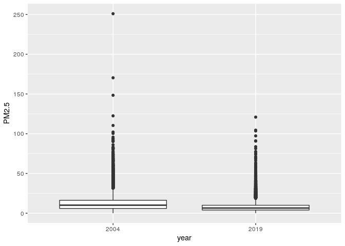
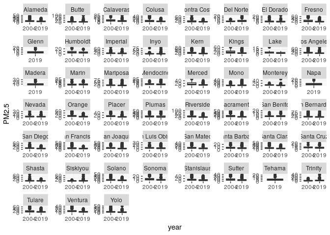
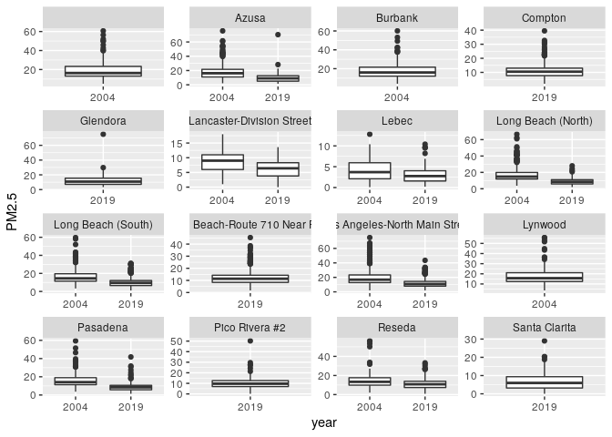

Assignment 1
================

Steps 1. Given the formulated question from the assignment description,
you will now conduct EDA Checklist items 2-4. First, download 2004 and
2019 data for all sites in California from the EPA Air Quality Data
website. Read in the data using data.table(). For each of the two
datasets, check the dimensions, headers, footers, variable names and
variable types. Check for any data issues, particularly in the key
variable we are analyzing. Make sure you write up a summary of all of
your findings.

2.  Combine the two years of data into one data frame. Use the Date
    variable to create a new column for year, which will serve as an
    identifier. Change the names of the key variables so that they are
    easier to refer to in your code.

3.  Create a basic map in leaflet() that shows the locations of the
    sites (make sure to use different colors for each year). Summarize
    the spatial distribution of the monitoring sites.

4.  Check for any missing or implausible values of PM in the combined
    dataset. Explore the proportions of each and provide a summary of
    any temporal patterns you see in these observations.

5.  Explore the main question of interest at three different spatial
    levels. Create exploratory plots (e.g. boxplots, histograms, line
    plots) and summary statistics that best suit each level of data. Be
    sure to write up explanations of what you observe in these data.
    state county site in Los Angeles

## Step 1: Read and check the data

``` r
#Install only if we don't have the package
if(!require(data.table)){
  install.packages("data.table")
}
```

    ## Loading required package: data.table

``` r
#load required package
library(data.table)

#Read in the data
data04 <- data.table::fread("Data04.csv")
data19 <- data.table::fread("Data19.csv")
```

For each of the two datasets, check the dimensions, headers, footers,
variable names and variable types

``` r
#2004
dim(data04)
```

    ## [1] 19233    20

``` r
head(data04)
```

    ##          Date Source  Site ID POC Daily Mean PM2.5 Concentration    UNITS
    ## 1: 01/01/2004    AQS 60010007   1                            8.9 ug/m3 LC
    ## 2: 01/02/2004    AQS 60010007   1                           12.2 ug/m3 LC
    ## 3: 01/03/2004    AQS 60010007   1                           16.5 ug/m3 LC
    ## 4: 01/04/2004    AQS 60010007   1                           19.5 ug/m3 LC
    ## 5: 01/05/2004    AQS 60010007   1                           11.5 ug/m3 LC
    ## 6: 01/06/2004    AQS 60010007   1                           32.5 ug/m3 LC
    ##    DAILY_AQI_VALUE Site Name DAILY_OBS_COUNT PERCENT_COMPLETE
    ## 1:              37 Livermore               1              100
    ## 2:              51 Livermore               1              100
    ## 3:              60 Livermore               1              100
    ## 4:              67 Livermore               1              100
    ## 5:              48 Livermore               1              100
    ## 6:              94 Livermore               1              100
    ##    AQS_PARAMETER_CODE                     AQS_PARAMETER_DESC CBSA_CODE
    ## 1:              88101               PM2.5 - Local Conditions     41860
    ## 2:              88502 Acceptable PM2.5 AQI & Speciation Mass     41860
    ## 3:              88502 Acceptable PM2.5 AQI & Speciation Mass     41860
    ## 4:              88502 Acceptable PM2.5 AQI & Speciation Mass     41860
    ## 5:              88502 Acceptable PM2.5 AQI & Speciation Mass     41860
    ## 6:              88502 Acceptable PM2.5 AQI & Speciation Mass     41860
    ##                            CBSA_NAME STATE_CODE      STATE COUNTY_CODE  COUNTY
    ## 1: San Francisco-Oakland-Hayward, CA          6 California           1 Alameda
    ## 2: San Francisco-Oakland-Hayward, CA          6 California           1 Alameda
    ## 3: San Francisco-Oakland-Hayward, CA          6 California           1 Alameda
    ## 4: San Francisco-Oakland-Hayward, CA          6 California           1 Alameda
    ## 5: San Francisco-Oakland-Hayward, CA          6 California           1 Alameda
    ## 6: San Francisco-Oakland-Hayward, CA          6 California           1 Alameda
    ##    SITE_LATITUDE SITE_LONGITUDE
    ## 1:      37.68753      -121.7842
    ## 2:      37.68753      -121.7842
    ## 3:      37.68753      -121.7842
    ## 4:      37.68753      -121.7842
    ## 5:      37.68753      -121.7842
    ## 6:      37.68753      -121.7842

``` r
tail(data04)
```

    ##          Date Source  Site ID POC Daily Mean PM2.5 Concentration    UNITS
    ## 1: 12/14/2004    AQS 61131003   1                             11 ug/m3 LC
    ## 2: 12/17/2004    AQS 61131003   1                             16 ug/m3 LC
    ## 3: 12/20/2004    AQS 61131003   1                             17 ug/m3 LC
    ## 4: 12/23/2004    AQS 61131003   1                              9 ug/m3 LC
    ## 5: 12/26/2004    AQS 61131003   1                             24 ug/m3 LC
    ## 6: 12/29/2004    AQS 61131003   1                              9 ug/m3 LC
    ##    DAILY_AQI_VALUE            Site Name DAILY_OBS_COUNT PERCENT_COMPLETE
    ## 1:              46 Woodland-Gibson Road               1              100
    ## 2:              59 Woodland-Gibson Road               1              100
    ## 3:              61 Woodland-Gibson Road               1              100
    ## 4:              38 Woodland-Gibson Road               1              100
    ## 5:              76 Woodland-Gibson Road               1              100
    ## 6:              38 Woodland-Gibson Road               1              100
    ##    AQS_PARAMETER_CODE       AQS_PARAMETER_DESC CBSA_CODE
    ## 1:              88101 PM2.5 - Local Conditions     40900
    ## 2:              88101 PM2.5 - Local Conditions     40900
    ## 3:              88101 PM2.5 - Local Conditions     40900
    ## 4:              88101 PM2.5 - Local Conditions     40900
    ## 5:              88101 PM2.5 - Local Conditions     40900
    ## 6:              88101 PM2.5 - Local Conditions     40900
    ##                                  CBSA_NAME STATE_CODE      STATE COUNTY_CODE
    ## 1: Sacramento--Roseville--Arden-Arcade, CA          6 California         113
    ## 2: Sacramento--Roseville--Arden-Arcade, CA          6 California         113
    ## 3: Sacramento--Roseville--Arden-Arcade, CA          6 California         113
    ## 4: Sacramento--Roseville--Arden-Arcade, CA          6 California         113
    ## 5: Sacramento--Roseville--Arden-Arcade, CA          6 California         113
    ## 6: Sacramento--Roseville--Arden-Arcade, CA          6 California         113
    ##    COUNTY SITE_LATITUDE SITE_LONGITUDE
    ## 1:   Yolo      38.66121      -121.7327
    ## 2:   Yolo      38.66121      -121.7327
    ## 3:   Yolo      38.66121      -121.7327
    ## 4:   Yolo      38.66121      -121.7327
    ## 5:   Yolo      38.66121      -121.7327
    ## 6:   Yolo      38.66121      -121.7327

``` r
str(data04)
```

    ## Classes 'data.table' and 'data.frame':   19233 obs. of  20 variables:
    ##  $ Date                          : chr  "01/01/2004" "01/02/2004" "01/03/2004" "01/04/2004" ...
    ##  $ Source                        : chr  "AQS" "AQS" "AQS" "AQS" ...
    ##  $ Site ID                       : int  60010007 60010007 60010007 60010007 60010007 60010007 60010007 60010007 60010007 60010007 ...
    ##  $ POC                           : int  1 1 1 1 1 1 1 1 1 1 ...
    ##  $ Daily Mean PM2.5 Concentration: num  8.9 12.2 16.5 19.5 11.5 32.5 14 29.9 21 15.7 ...
    ##  $ UNITS                         : chr  "ug/m3 LC" "ug/m3 LC" "ug/m3 LC" "ug/m3 LC" ...
    ##  $ DAILY_AQI_VALUE               : int  37 51 60 67 48 94 55 88 70 59 ...
    ##  $ Site Name                     : chr  "Livermore" "Livermore" "Livermore" "Livermore" ...
    ##  $ DAILY_OBS_COUNT               : int  1 1 1 1 1 1 1 1 1 1 ...
    ##  $ PERCENT_COMPLETE              : num  100 100 100 100 100 100 100 100 100 100 ...
    ##  $ AQS_PARAMETER_CODE            : int  88101 88502 88502 88502 88502 88502 88101 88502 88502 88101 ...
    ##  $ AQS_PARAMETER_DESC            : chr  "PM2.5 - Local Conditions" "Acceptable PM2.5 AQI & Speciation Mass" "Acceptable PM2.5 AQI & Speciation Mass" "Acceptable PM2.5 AQI & Speciation Mass" ...
    ##  $ CBSA_CODE                     : int  41860 41860 41860 41860 41860 41860 41860 41860 41860 41860 ...
    ##  $ CBSA_NAME                     : chr  "San Francisco-Oakland-Hayward, CA" "San Francisco-Oakland-Hayward, CA" "San Francisco-Oakland-Hayward, CA" "San Francisco-Oakland-Hayward, CA" ...
    ##  $ STATE_CODE                    : int  6 6 6 6 6 6 6 6 6 6 ...
    ##  $ STATE                         : chr  "California" "California" "California" "California" ...
    ##  $ COUNTY_CODE                   : int  1 1 1 1 1 1 1 1 1 1 ...
    ##  $ COUNTY                        : chr  "Alameda" "Alameda" "Alameda" "Alameda" ...
    ##  $ SITE_LATITUDE                 : num  37.7 37.7 37.7 37.7 37.7 ...
    ##  $ SITE_LONGITUDE                : num  -122 -122 -122 -122 -122 ...
    ##  - attr(*, ".internal.selfref")=<externalptr>

``` r
#2019
dim(data19)
```

    ## [1] 53086    20

``` r
head(data19)
```

    ##          Date Source  Site ID POC Daily Mean PM2.5 Concentration    UNITS
    ## 1: 01/01/2019    AQS 60010007   3                            5.7 ug/m3 LC
    ## 2: 01/02/2019    AQS 60010007   3                           11.9 ug/m3 LC
    ## 3: 01/03/2019    AQS 60010007   3                           20.1 ug/m3 LC
    ## 4: 01/04/2019    AQS 60010007   3                           28.8 ug/m3 LC
    ## 5: 01/05/2019    AQS 60010007   3                           11.2 ug/m3 LC
    ## 6: 01/06/2019    AQS 60010007   3                            2.7 ug/m3 LC
    ##    DAILY_AQI_VALUE Site Name DAILY_OBS_COUNT PERCENT_COMPLETE
    ## 1:              24 Livermore               1              100
    ## 2:              50 Livermore               1              100
    ## 3:              68 Livermore               1              100
    ## 4:              86 Livermore               1              100
    ## 5:              47 Livermore               1              100
    ## 6:              11 Livermore               1              100
    ##    AQS_PARAMETER_CODE       AQS_PARAMETER_DESC CBSA_CODE
    ## 1:              88101 PM2.5 - Local Conditions     41860
    ## 2:              88101 PM2.5 - Local Conditions     41860
    ## 3:              88101 PM2.5 - Local Conditions     41860
    ## 4:              88101 PM2.5 - Local Conditions     41860
    ## 5:              88101 PM2.5 - Local Conditions     41860
    ## 6:              88101 PM2.5 - Local Conditions     41860
    ##                            CBSA_NAME STATE_CODE      STATE COUNTY_CODE  COUNTY
    ## 1: San Francisco-Oakland-Hayward, CA          6 California           1 Alameda
    ## 2: San Francisco-Oakland-Hayward, CA          6 California           1 Alameda
    ## 3: San Francisco-Oakland-Hayward, CA          6 California           1 Alameda
    ## 4: San Francisco-Oakland-Hayward, CA          6 California           1 Alameda
    ## 5: San Francisco-Oakland-Hayward, CA          6 California           1 Alameda
    ## 6: San Francisco-Oakland-Hayward, CA          6 California           1 Alameda
    ##    SITE_LATITUDE SITE_LONGITUDE
    ## 1:      37.68753      -121.7842
    ## 2:      37.68753      -121.7842
    ## 3:      37.68753      -121.7842
    ## 4:      37.68753      -121.7842
    ## 5:      37.68753      -121.7842
    ## 6:      37.68753      -121.7842

``` r
tail(data19)
```

    ##          Date Source  Site ID POC Daily Mean PM2.5 Concentration    UNITS
    ## 1: 11/11/2019    AQS 61131003   1                           13.5 ug/m3 LC
    ## 2: 11/17/2019    AQS 61131003   1                           18.1 ug/m3 LC
    ## 3: 11/29/2019    AQS 61131003   1                           12.5 ug/m3 LC
    ## 4: 12/17/2019    AQS 61131003   1                           23.8 ug/m3 LC
    ## 5: 12/23/2019    AQS 61131003   1                            1.0 ug/m3 LC
    ## 6: 12/29/2019    AQS 61131003   1                            9.1 ug/m3 LC
    ##    DAILY_AQI_VALUE            Site Name DAILY_OBS_COUNT PERCENT_COMPLETE
    ## 1:              54 Woodland-Gibson Road               1              100
    ## 2:              64 Woodland-Gibson Road               1              100
    ## 3:              52 Woodland-Gibson Road               1              100
    ## 4:              76 Woodland-Gibson Road               1              100
    ## 5:               4 Woodland-Gibson Road               1              100
    ## 6:              38 Woodland-Gibson Road               1              100
    ##    AQS_PARAMETER_CODE       AQS_PARAMETER_DESC CBSA_CODE
    ## 1:              88101 PM2.5 - Local Conditions     40900
    ## 2:              88101 PM2.5 - Local Conditions     40900
    ## 3:              88101 PM2.5 - Local Conditions     40900
    ## 4:              88101 PM2.5 - Local Conditions     40900
    ## 5:              88101 PM2.5 - Local Conditions     40900
    ## 6:              88101 PM2.5 - Local Conditions     40900
    ##                                  CBSA_NAME STATE_CODE      STATE COUNTY_CODE
    ## 1: Sacramento--Roseville--Arden-Arcade, CA          6 California         113
    ## 2: Sacramento--Roseville--Arden-Arcade, CA          6 California         113
    ## 3: Sacramento--Roseville--Arden-Arcade, CA          6 California         113
    ## 4: Sacramento--Roseville--Arden-Arcade, CA          6 California         113
    ## 5: Sacramento--Roseville--Arden-Arcade, CA          6 California         113
    ## 6: Sacramento--Roseville--Arden-Arcade, CA          6 California         113
    ##    COUNTY SITE_LATITUDE SITE_LONGITUDE
    ## 1:   Yolo      38.66121      -121.7327
    ## 2:   Yolo      38.66121      -121.7327
    ## 3:   Yolo      38.66121      -121.7327
    ## 4:   Yolo      38.66121      -121.7327
    ## 5:   Yolo      38.66121      -121.7327
    ## 6:   Yolo      38.66121      -121.7327

``` r
str(data19)
```

    ## Classes 'data.table' and 'data.frame':   53086 obs. of  20 variables:
    ##  $ Date                          : chr  "01/01/2019" "01/02/2019" "01/03/2019" "01/04/2019" ...
    ##  $ Source                        : chr  "AQS" "AQS" "AQS" "AQS" ...
    ##  $ Site ID                       : int  60010007 60010007 60010007 60010007 60010007 60010007 60010007 60010007 60010007 60010007 ...
    ##  $ POC                           : int  3 3 3 3 3 3 3 3 3 3 ...
    ##  $ Daily Mean PM2.5 Concentration: num  5.7 11.9 20.1 28.8 11.2 2.7 2.8 7 3.1 7.1 ...
    ##  $ UNITS                         : chr  "ug/m3 LC" "ug/m3 LC" "ug/m3 LC" "ug/m3 LC" ...
    ##  $ DAILY_AQI_VALUE               : int  24 50 68 86 47 11 12 29 13 30 ...
    ##  $ Site Name                     : chr  "Livermore" "Livermore" "Livermore" "Livermore" ...
    ##  $ DAILY_OBS_COUNT               : int  1 1 1 1 1 1 1 1 1 1 ...
    ##  $ PERCENT_COMPLETE              : num  100 100 100 100 100 100 100 100 100 100 ...
    ##  $ AQS_PARAMETER_CODE            : int  88101 88101 88101 88101 88101 88101 88101 88101 88101 88101 ...
    ##  $ AQS_PARAMETER_DESC            : chr  "PM2.5 - Local Conditions" "PM2.5 - Local Conditions" "PM2.5 - Local Conditions" "PM2.5 - Local Conditions" ...
    ##  $ CBSA_CODE                     : int  41860 41860 41860 41860 41860 41860 41860 41860 41860 41860 ...
    ##  $ CBSA_NAME                     : chr  "San Francisco-Oakland-Hayward, CA" "San Francisco-Oakland-Hayward, CA" "San Francisco-Oakland-Hayward, CA" "San Francisco-Oakland-Hayward, CA" ...
    ##  $ STATE_CODE                    : int  6 6 6 6 6 6 6 6 6 6 ...
    ##  $ STATE                         : chr  "California" "California" "California" "California" ...
    ##  $ COUNTY_CODE                   : int  1 1 1 1 1 1 1 1 1 1 ...
    ##  $ COUNTY                        : chr  "Alameda" "Alameda" "Alameda" "Alameda" ...
    ##  $ SITE_LATITUDE                 : num  37.7 37.7 37.7 37.7 37.7 ...
    ##  $ SITE_LONGITUDE                : num  -122 -122 -122 -122 -122 ...
    ##  - attr(*, ".internal.selfref")=<externalptr>

Check for any data issues, particularly in the key variable we are
analyzing. Make sure you write up a summary of all of your findings.

``` r
#2004
table(data04$Date)
```

    ## 
    ## 01/01/2004 01/02/2004 01/03/2004 01/04/2004 01/05/2004 01/06/2004 01/07/2004 
    ##         80         23         22        108         19         22         89 
    ## 01/08/2004 01/09/2004 01/10/2004 01/11/2004 01/12/2004 01/13/2004 01/14/2004 
    ##         26         25        128         25         24         96         23 
    ## 01/15/2004 01/16/2004 01/17/2004 01/18/2004 01/19/2004 01/20/2004 01/21/2004 
    ##         23        116         25         26         80         20         22 
    ## 01/22/2004 01/23/2004 01/24/2004 01/25/2004 01/26/2004 01/27/2004 01/28/2004 
    ##        123         23         24         88         23         24        122 
    ## 01/29/2004 01/30/2004 01/31/2004 02/01/2004 02/02/2004 02/03/2004 02/04/2004 
    ##         28         26         90         24         23        121         20 
    ## 02/05/2004 02/06/2004 02/07/2004 02/08/2004 02/09/2004 02/10/2004 02/11/2004 
    ##         23         82         25         24        120         21         25 
    ## 02/12/2004 02/13/2004 02/14/2004 02/15/2004 02/16/2004 02/17/2004 02/18/2004 
    ##         86         23         25        120         22         21         83 
    ## 02/19/2004 02/20/2004 02/21/2004 02/22/2004 02/23/2004 02/24/2004 02/25/2004 
    ##         21         23        122         24         23         91         22 
    ## 02/26/2004 02/27/2004 02/28/2004 02/29/2004 03/01/2004 03/02/2004 03/03/2004 
    ##         24        115         26         25         81         23         24 
    ## 03/04/2004 03/05/2004 03/06/2004 03/07/2004 03/08/2004 03/09/2004 03/10/2004 
    ##        128         25         26         91         24         24        117 
    ## 03/11/2004 03/12/2004 03/13/2004 03/14/2004 03/15/2004 03/16/2004 03/17/2004 
    ##         21         21         86         24         22        122         21 
    ## 03/18/2004 03/19/2004 03/20/2004 03/21/2004 03/22/2004 03/23/2004 03/24/2004 
    ##         25         92         25         25        124         23         24 
    ## 03/25/2004 03/26/2004 03/27/2004 03/28/2004 03/29/2004 03/30/2004 03/31/2004 
    ##         91         24         23        127         23         22         86 
    ## 04/01/2004 04/02/2004 04/03/2004 04/04/2004 04/05/2004 04/06/2004 04/07/2004 
    ##         19         20        123         18         16         84         19 
    ## 04/08/2004 04/09/2004 04/10/2004 04/11/2004 04/12/2004 04/13/2004 04/14/2004 
    ##         21        117         21         21         71         18         17 
    ## 04/15/2004 04/16/2004 04/17/2004 04/18/2004 04/19/2004 04/20/2004 04/21/2004 
    ##        123         17         18         79         17         19        125 
    ## 04/22/2004 04/23/2004 04/24/2004 04/25/2004 04/26/2004 04/27/2004 04/28/2004 
    ##         20         19         82         20         20        126         21 
    ## 04/29/2004 04/30/2004 05/01/2004 05/02/2004 05/03/2004 05/04/2004 05/05/2004 
    ##         20         83         19         20        123         17         18 
    ## 05/06/2004 05/07/2004 05/08/2004 05/09/2004 05/10/2004 05/11/2004 05/12/2004 
    ##         82         19         19        126         18         19         85 
    ## 05/13/2004 05/14/2004 05/15/2004 05/16/2004 05/17/2004 05/18/2004 05/19/2004 
    ##         21         20        125         20         18         86         18 
    ## 05/20/2004 05/21/2004 05/22/2004 05/23/2004 05/24/2004 05/25/2004 05/26/2004 
    ##         17        120         22         20         74         20         23 
    ## 05/27/2004 05/28/2004 05/29/2004 05/30/2004 05/31/2004 06/01/2004 06/02/2004 
    ##        125         20         22         82         22         21        130 
    ## 06/03/2004 06/04/2004 06/05/2004 06/06/2004 06/07/2004 06/08/2004 06/09/2004 
    ##         22         21         88         22         21        127         22 
    ## 06/10/2004 06/11/2004 06/12/2004 06/13/2004 06/14/2004 06/15/2004 06/16/2004 
    ##         21         82         22         22        113         20         26 
    ## 06/17/2004 06/18/2004 06/19/2004 06/20/2004 06/21/2004 06/22/2004 06/23/2004 
    ##         91         25         28        133         26         26         92 
    ## 06/24/2004 06/25/2004 06/26/2004 06/27/2004 06/28/2004 06/29/2004 06/30/2004 
    ##         31         27        138         28         28         95         31 
    ## 07/01/2004 07/02/2004 07/03/2004 07/04/2004 07/05/2004 07/06/2004 07/07/2004 
    ##         27        124         29         27         87         26         28 
    ## 07/08/2004 07/09/2004 07/10/2004 07/11/2004 07/12/2004 07/13/2004 07/14/2004 
    ##        130         25         26         93         23         26        130 
    ## 07/15/2004 07/16/2004 07/17/2004 07/18/2004 07/19/2004 07/20/2004 07/21/2004 
    ##         29         26         91         25         25        129         28 
    ## 07/22/2004 07/23/2004 07/24/2004 07/25/2004 07/26/2004 07/27/2004 07/28/2004 
    ##         26         85         29         27        128         23         24 
    ## 07/29/2004 07/30/2004 07/31/2004 08/01/2004 08/02/2004 08/03/2004 08/04/2004 
    ##         80         22         23        121         22         26         87 
    ## 08/05/2004 08/06/2004 08/07/2004 08/08/2004 08/09/2004 08/10/2004 08/11/2004 
    ##         25         25        128         24         24         89         25 
    ## 08/12/2004 08/13/2004 08/14/2004 08/15/2004 08/16/2004 08/17/2004 08/18/2004 
    ##         23        114         24         25         83         24         25 
    ## 08/19/2004 08/20/2004 08/21/2004 08/22/2004 08/23/2004 08/24/2004 08/25/2004 
    ##        124         26         27         86         24         26        131 
    ## 08/26/2004 08/27/2004 08/28/2004 08/29/2004 08/30/2004 08/31/2004 09/01/2004 
    ##         24         27         87         28         28        122         27 
    ## 09/02/2004 09/03/2004 09/04/2004 09/05/2004 09/06/2004 09/07/2004 09/08/2004 
    ##         26         89         27         27        128         25         27 
    ## 09/09/2004 09/10/2004 09/11/2004 09/12/2004 09/13/2004 09/14/2004 09/15/2004 
    ##         84         25         27        134         28         27         89 
    ## 09/16/2004 09/17/2004 09/18/2004 09/19/2004 09/20/2004 09/21/2004 09/22/2004 
    ##         28         26        136         27         26         93         26 
    ## 09/23/2004 09/24/2004 09/25/2004 09/26/2004 09/27/2004 09/28/2004 09/29/2004 
    ##         27        126         26         27         86         25         30 
    ## 09/30/2004 10/01/2004 10/02/2004 10/03/2004 10/04/2004 10/05/2004 10/06/2004 
    ##        126         29         29         98         31         30        129 
    ## 10/07/2004 10/08/2004 10/09/2004 10/10/2004 10/11/2004 10/12/2004 10/13/2004 
    ##         34         33        100         32         31        129         32 
    ## 10/14/2004 10/15/2004 10/16/2004 10/17/2004 10/18/2004 10/19/2004 10/20/2004 
    ##         33         99         34         32        124         32         31 
    ## 10/21/2004 10/22/2004 10/23/2004 10/24/2004 10/25/2004 10/26/2004 10/27/2004 
    ##         95         29         30        127         29         31         90 
    ## 10/28/2004 10/29/2004 10/30/2004 10/31/2004 11/01/2004 11/02/2004 11/03/2004 
    ##         32         30        133         31         28         91         33 
    ## 11/04/2004 11/05/2004 11/06/2004 11/07/2004 11/08/2004 11/09/2004 11/10/2004 
    ##         30        117         34         30         95         31         31 
    ## 11/11/2004 11/12/2004 11/13/2004 11/14/2004 11/15/2004 11/16/2004 11/17/2004 
    ##        136         31         31         99         31         33        127 
    ## 11/18/2004 11/19/2004 11/20/2004 11/21/2004 11/22/2004 11/23/2004 11/24/2004 
    ##         32         33        102         32         32        129         31 
    ## 11/25/2004 11/26/2004 11/27/2004 11/28/2004 11/29/2004 11/30/2004 12/01/2004 
    ##         33         99         31         30        121         30         31 
    ## 12/02/2004 12/03/2004 12/04/2004 12/05/2004 12/06/2004 12/07/2004 12/08/2004 
    ##         92         29         34        125         31         33         91 
    ## 12/09/2004 12/10/2004 12/11/2004 12/12/2004 12/13/2004 12/14/2004 12/15/2004 
    ##         34         32        131         30         30        106         31 
    ## 12/16/2004 12/17/2004 12/18/2004 12/19/2004 12/20/2004 12/21/2004 12/22/2004 
    ##         30        115         33         31         95         32         29 
    ## 12/23/2004 12/24/2004 12/25/2004 12/26/2004 12/27/2004 12/28/2004 12/29/2004 
    ##        130         30         33         90         31         32        129 
    ## 12/30/2004 12/31/2004 
    ##         32         35

``` r
table(data04$UNITS)
```

    ## 
    ## ug/m3 LC 
    ##    19233

``` r
table(data04$STATE)
```

    ## 
    ## California 
    ##      19233

``` r
summary(data04$`Daily Mean PM2.5 Concentration`)
```

    ##    Min. 1st Qu.  Median    Mean 3rd Qu.    Max. 
    ##   -0.10    6.00   10.10   13.13   16.30  251.00

``` r
data04[`Daily Mean PM2.5 Concentration`<0][order(`Daily Mean PM2.5 Concentration`)]
```

    ##          Date Source  Site ID POC Daily Mean PM2.5 Concentration    UNITS
    ## 1: 12/08/2004    AQS 60199000   1                           -0.1 ug/m3 LC
    ##    DAILY_AQI_VALUE         Site Name DAILY_OBS_COUNT PERCENT_COMPLETE
    ## 1:               0 Kaiser Wilderness               1              100
    ##    AQS_PARAMETER_CODE                     AQS_PARAMETER_DESC CBSA_CODE
    ## 1:              88502 Acceptable PM2.5 AQI & Speciation Mass     23420
    ##     CBSA_NAME STATE_CODE      STATE COUNTY_CODE COUNTY SITE_LATITUDE
    ## 1: Fresno, CA          6 California          19 Fresno      37.22064
    ##    SITE_LONGITUDE
    ## 1:      -119.1556

``` r
data04rm <- data04[`Daily Mean PM2.5 Concentration`>=0]
mean(is.na(data04$`Daily Mean PM2.5 Concentration`))
```

    ## [1] 0

``` r
summary(data04$SITE_LATITUDE)
```

    ##    Min. 1st Qu.  Median    Mean 3rd Qu.    Max. 
    ##   32.63   34.07   36.48   36.23   38.10   41.71

``` r
summary(data04$SITE_LONGITUDE)
```

    ##    Min. 1st Qu.  Median    Mean 3rd Qu.    Max. 
    ##  -124.2  -121.6  -119.3  -119.7  -117.9  -115.5

``` r
#2019
table(data19$Date)
```

    ## 
    ## 01/01/2019 01/02/2019 01/03/2019 01/04/2019 01/05/2019 01/06/2019 01/07/2019 
    ##        124        116        180        124        123        152        121 
    ## 01/08/2019 01/09/2019 01/10/2019 01/11/2019 01/12/2019 01/13/2019 01/14/2019 
    ##        119        185        120        116        156        121        121 
    ## 01/15/2019 01/16/2019 01/17/2019 01/18/2019 01/19/2019 01/20/2019 01/21/2019 
    ##        183        124        124        155        124        121        187 
    ## 01/22/2019 01/23/2019 01/24/2019 01/25/2019 01/26/2019 01/27/2019 01/28/2019 
    ##        118        120        158        123        123        187        121 
    ## 01/29/2019 01/30/2019 01/31/2019 02/01/2019 02/02/2019 02/03/2019 02/04/2019 
    ##        123        166        123        125        197        122        122 
    ## 02/05/2019 02/06/2019 02/07/2019 02/08/2019 02/09/2019 02/10/2019 02/11/2019 
    ##        164        122        123        185        127        124        166 
    ## 02/12/2019 02/13/2019 02/14/2019 02/15/2019 02/16/2019 02/17/2019 02/18/2019 
    ##        125        126        198        126        128        168        125 
    ## 02/19/2019 02/20/2019 02/21/2019 02/22/2019 02/23/2019 02/24/2019 02/25/2019 
    ##        127        185        123        124        170        124        123 
    ## 02/26/2019 02/27/2019 02/28/2019 03/01/2019 03/02/2019 03/03/2019 03/04/2019 
    ##        197        123        120        168        127        129        198 
    ## 03/05/2019 03/06/2019 03/07/2019 03/08/2019 03/09/2019 03/10/2019 03/11/2019 
    ##        125        126        165        126        127        203        127 
    ## 03/12/2019 03/13/2019 03/14/2019 03/15/2019 03/16/2019 03/17/2019 03/18/2019 
    ##        131        174        125        123        192        124        122 
    ## 03/19/2019 03/20/2019 03/21/2019 03/22/2019 03/23/2019 03/24/2019 03/25/2019 
    ##        176        126        125        204        130        128        172 
    ## 03/26/2019 03/27/2019 03/28/2019 03/29/2019 03/30/2019 03/31/2019 04/01/2019 
    ##        130        130        197        129        129        177        130 
    ## 04/02/2019 04/03/2019 04/04/2019 04/05/2019 04/06/2019 04/07/2019 04/08/2019 
    ##        126        205        132        130        176        131        128 
    ## 04/09/2019 04/10/2019 04/11/2019 04/12/2019 04/13/2019 04/14/2019 04/15/2019 
    ##        195        127        123        170        130        130        205 
    ## 04/16/2019 04/17/2019 04/18/2019 04/19/2019 04/20/2019 04/21/2019 04/22/2019 
    ##        130        130        175        131        130        202        133 
    ## 04/23/2019 04/24/2019 04/25/2019 04/26/2019 04/27/2019 04/28/2019 04/29/2019 
    ##        133        174        130        127        208        125        125 
    ## 04/30/2019 05/01/2019 05/02/2019 05/03/2019 05/04/2019 05/05/2019 05/06/2019 
    ##        172        128        127        193        127        127        176 
    ## 05/07/2019 05/08/2019 05/09/2019 05/10/2019 05/11/2019 05/12/2019 05/13/2019 
    ##        128        127        206        126        127        174        122 
    ## 05/14/2019 05/15/2019 05/16/2019 05/17/2019 05/18/2019 05/19/2019 05/20/2019 
    ##        125        198        128        125        176        127        127 
    ## 05/21/2019 05/22/2019 05/23/2019 05/24/2019 05/25/2019 05/26/2019 05/27/2019 
    ##        208        128        129        178        131        130        203 
    ## 05/28/2019 05/29/2019 05/30/2019 05/31/2019 06/01/2019 06/02/2019 06/03/2019 
    ##        128        129        174        127        129        209        127 
    ## 06/04/2019 06/05/2019 06/06/2019 06/07/2019 06/08/2019 06/09/2019 06/10/2019 
    ##        127        175        127        129        198        127        124 
    ## 06/11/2019 06/12/2019 06/13/2019 06/14/2019 06/15/2019 06/16/2019 06/17/2019 
    ##        176        131        129        205        136        131        174 
    ## 06/18/2019 06/19/2019 06/20/2019 06/21/2019 06/22/2019 06/23/2019 06/24/2019 
    ##        131        129        195        125        128        172        128 
    ## 06/25/2019 06/26/2019 06/27/2019 06/28/2019 06/29/2019 06/30/2019 07/01/2019 
    ##        130        206        130        131        177        131        131 
    ## 07/02/2019 07/03/2019 07/04/2019 07/05/2019 07/06/2019 07/07/2019 07/08/2019 
    ##        202        132        132        181        133        132        207 
    ## 07/09/2019 07/10/2019 07/11/2019 07/12/2019 07/13/2019 07/14/2019 07/15/2019 
    ##        131        131        178        130        131        205        127 
    ## 07/16/2019 07/17/2019 07/18/2019 07/19/2019 07/20/2019 07/21/2019 07/22/2019 
    ##        131        178        129        129        213        130        125 
    ## 07/23/2019 07/24/2019 07/25/2019 07/26/2019 07/27/2019 07/28/2019 07/29/2019 
    ##        174        126        127        198        130        130        172 
    ## 07/30/2019 07/31/2019 08/01/2019 08/02/2019 08/03/2019 08/04/2019 08/05/2019 
    ##        133        129        205        128        129        177        124 
    ## 08/06/2019 08/07/2019 08/08/2019 08/09/2019 08/10/2019 08/11/2019 08/12/2019 
    ##        128        197        125        128        173        129        127 
    ## 08/13/2019 08/14/2019 08/15/2019 08/16/2019 08/17/2019 08/18/2019 08/19/2019 
    ##        207        128        130        171        128        127        199 
    ## 08/20/2019 08/21/2019 08/22/2019 08/23/2019 08/24/2019 08/25/2019 08/26/2019 
    ##        127        130        167        130        126        204        122 
    ## 08/27/2019 08/28/2019 08/29/2019 08/30/2019 08/31/2019 09/01/2019 09/02/2019 
    ##        127        170        124        128        193        129        127 
    ## 09/03/2019 09/04/2019 09/05/2019 09/06/2019 09/07/2019 09/08/2019 09/09/2019 
    ##        166        123        126        207        128        125        170 
    ## 09/10/2019 09/11/2019 09/12/2019 09/13/2019 09/14/2019 09/15/2019 09/16/2019 
    ##        125        123        198        129        126        174        120 
    ## 09/17/2019 09/18/2019 09/19/2019 09/20/2019 09/21/2019 09/22/2019 09/23/2019 
    ##        121        203        123        119        172        123        124 
    ## 09/24/2019 09/25/2019 09/26/2019 09/27/2019 09/28/2019 09/29/2019 09/30/2019 
    ##        195        124        127        177        128        127        205 
    ## 10/01/2019 10/02/2019 10/03/2019 10/04/2019 10/05/2019 10/06/2019 10/07/2019 
    ##        126        126        171        128        126        196        125 
    ## 10/08/2019 10/09/2019 10/10/2019 10/11/2019 10/12/2019 10/13/2019 10/14/2019 
    ##        126        164        117        122        201        124        123 
    ## 10/15/2019 10/16/2019 10/17/2019 10/18/2019 10/19/2019 10/20/2019 10/21/2019 
    ##        175        128        125        189        124        126        169 
    ## 10/22/2019 10/23/2019 10/24/2019 10/25/2019 10/26/2019 10/27/2019 10/28/2019 
    ##        124        124        200        127        125        153        112 
    ## 10/29/2019 10/30/2019 10/31/2019 11/01/2019 11/02/2019 11/03/2019 11/04/2019 
    ##        118        177        123        128        176        129        127 
    ## 11/05/2019 11/06/2019 11/07/2019 11/08/2019 11/09/2019 11/10/2019 11/11/2019 
    ##        201        128        127        174        128        129        196 
    ## 11/12/2019 11/13/2019 11/14/2019 11/15/2019 11/16/2019 11/17/2019 11/18/2019 
    ##        127        126        177        124        124        202        123 
    ## 11/19/2019 11/20/2019 11/21/2019 11/22/2019 11/23/2019 11/24/2019 11/25/2019 
    ##        125        165        126        128        193        127        126 
    ## 11/26/2019 11/27/2019 11/28/2019 11/29/2019 11/30/2019 12/01/2019 12/02/2019 
    ##        168        128        126        199        127        123        168 
    ## 12/03/2019 12/04/2019 12/05/2019 12/06/2019 12/07/2019 12/08/2019 12/09/2019 
    ##        126        126        187        120        120        167        117 
    ## 12/10/2019 12/11/2019 12/12/2019 12/13/2019 12/14/2019 12/15/2019 12/16/2019 
    ##        119        196        122        117        169        121        120 
    ## 12/17/2019 12/18/2019 12/19/2019 12/20/2019 12/21/2019 12/22/2019 12/23/2019 
    ##        186        125        129        174        129        128        203 
    ## 12/24/2019 12/25/2019 12/26/2019 12/27/2019 12/28/2019 12/29/2019 12/30/2019 
    ##        129        129        165        123        123        191        120 
    ## 12/31/2019 
    ##        126

``` r
table(data19$UNITS)
```

    ## 
    ## ug/m3 LC 
    ##    53086

``` r
table(data19$STATE)
```

    ## 
    ## California 
    ##      53086

``` r
summary(data19$`Daily Mean PM2.5 Concentration`)
```

    ##    Min. 1st Qu.  Median    Mean 3rd Qu.    Max. 
    ##  -2.200   4.000   6.500   7.734   9.900 120.900

``` r
data19[`Daily Mean PM2.5 Concentration`<0][order(`Daily Mean PM2.5 Concentration`)]
```

    ##            Date Source  Site ID POC Daily Mean PM2.5 Concentration    UNITS
    ##   1: 03/16/2019    AQS 60130002   3                           -2.2 ug/m3 LC
    ##   2: 03/02/2019    AQS 60611004   3                           -2.0 ug/m3 LC
    ##   3: 03/05/2019    AQS 60611004   3                           -2.0 ug/m3 LC
    ##   4: 03/06/2019    AQS 60611004   3                           -2.0 ug/m3 LC
    ##   5: 03/07/2019    AQS 60611004   3                           -2.0 ug/m3 LC
    ##  ---                                                                       
    ## 278: 02/18/2019    AQS 60832011   1                           -0.1 ug/m3 LC
    ## 279: 04/05/2019    AQS 60832011   1                           -0.1 ug/m3 LC
    ## 280: 12/26/2019    AQS 61110007   3                           -0.1 ug/m3 LC
    ## 281: 01/06/2019    AQS 61110009   3                           -0.1 ug/m3 LC
    ## 282: 01/07/2019    AQS 61110009   3                           -0.1 ug/m3 LC
    ##      DAILY_AQI_VALUE                Site Name DAILY_OBS_COUNT PERCENT_COMPLETE
    ##   1:               0                  Concord               1              100
    ##   2:               0 Tahoe City-Fairway Drive               1              100
    ##   3:               0 Tahoe City-Fairway Drive               1              100
    ##   4:               0 Tahoe City-Fairway Drive               1              100
    ##   5:               0 Tahoe City-Fairway Drive               1              100
    ##  ---                                                                          
    ## 278:               0                   Goleta               1              100
    ## 279:               0                   Goleta               1              100
    ## 280:               0            Thousand Oaks               1              100
    ## 281:               0           Piru - Pacific               1              100
    ## 282:               0           Piru - Pacific               1              100
    ##      AQS_PARAMETER_CODE                     AQS_PARAMETER_DESC CBSA_CODE
    ##   1:              88101               PM2.5 - Local Conditions     41860
    ##   2:              88502 Acceptable PM2.5 AQI & Speciation Mass     40900
    ##   3:              88502 Acceptable PM2.5 AQI & Speciation Mass     40900
    ##   4:              88502 Acceptable PM2.5 AQI & Speciation Mass     40900
    ##   5:              88502 Acceptable PM2.5 AQI & Speciation Mass     40900
    ##  ---                                                                    
    ## 278:              88101               PM2.5 - Local Conditions     42200
    ## 279:              88101               PM2.5 - Local Conditions     42200
    ## 280:              88101               PM2.5 - Local Conditions     37100
    ## 281:              88101               PM2.5 - Local Conditions     37100
    ## 282:              88101               PM2.5 - Local Conditions     37100
    ##                                    CBSA_NAME STATE_CODE      STATE COUNTY_CODE
    ##   1:       San Francisco-Oakland-Hayward, CA          6 California          13
    ##   2: Sacramento--Roseville--Arden-Arcade, CA          6 California          61
    ##   3: Sacramento--Roseville--Arden-Arcade, CA          6 California          61
    ##   4: Sacramento--Roseville--Arden-Arcade, CA          6 California          61
    ##   5: Sacramento--Roseville--Arden-Arcade, CA          6 California          61
    ##  ---                                                                          
    ## 278:           Santa Maria-Santa Barbara, CA          6 California          83
    ## 279:           Santa Maria-Santa Barbara, CA          6 California          83
    ## 280:        Oxnard-Thousand Oaks-Ventura, CA          6 California         111
    ## 281:        Oxnard-Thousand Oaks-Ventura, CA          6 California         111
    ## 282:        Oxnard-Thousand Oaks-Ventura, CA          6 California         111
    ##             COUNTY SITE_LATITUDE SITE_LONGITUDE
    ##   1:  Contra Costa      37.93601      -122.0262
    ##   2:        Placer      39.16602      -120.1488
    ##   3:        Placer      39.16602      -120.1488
    ##   4:        Placer      39.16602      -120.1488
    ##   5:        Placer      39.16602      -120.1488
    ##  ---                                           
    ## 278: Santa Barbara      34.44551      -119.8284
    ## 279: Santa Barbara      34.44551      -119.8284
    ## 280:       Ventura      34.21017      -118.8705
    ## 281:       Ventura      34.40428      -118.8100
    ## 282:       Ventura      34.40428      -118.8100

``` r
data19rm <- data19[`Daily Mean PM2.5 Concentration`>=0]
mean(is.na(data19$`Daily Mean PM2.5 Concentration`))
```

    ## [1] 0

``` r
summary(data19$SITE_LATITUDE)
```

    ##    Min. 1st Qu.  Median    Mean 3rd Qu.    Max. 
    ##   32.58   34.14   36.63   36.35   37.97   41.76

``` r
summary(data19$SITE_LONGITUDE)
```

    ##    Min. 1st Qu.  Median    Mean 3rd Qu.    Max. 
    ##  -124.2  -121.6  -119.8  -119.8  -118.1  -115.5

Summary: There is no missing value in the key varaibles we are
analyzing. There are some negative values in daily mean PM2.5
concentration. The mean, median and maximum value of daily mean PM2.5
concentration in California decreased from 2004 to 2019. Throughout the
2004, the daily mean PM2.5 concentration in California has a mean value
of 13.13 ug/m3 and median value of 10.10 ug/m3 with the range from 0 to
251 ug/m3. Throughout the 2019, the daily mean PM2.5 concentration in
California has a mean value of 7.78 ug/m3 and median value of 6.5 ug/m3
with the range from 0 to 120.90 ug/m3.

\#Step 2: combine and organize the data

``` r
#Combine the two years of data into one data frame. 
total <- rbind(data04, data19)
totalrm <- rbind(data04rm, data19rm)

#Use the Date variable to create a new column for year, which will serve as an identifier. 
totalrm$Date <- as.POSIXct(totalrm$Date, format = "%m/%d/%Y")
totalrm$year <- format(totalrm$Date, format = "%Y")
table(totalrm$year)
```

    ## 
    ##  2004  2019 
    ## 19232 52804

``` r
#Change the names of the key variables so that they are easier to refer to in your code.
names(totalrm)[names(totalrm) == "Daily Mean PM2.5 Concentration"] <- "PM2.5"
names(totalrm)[names(totalrm) == "SITE_LATITUDE"] <- "lat"
names(totalrm)[names(totalrm) == "SITE_LONGITUDE"] <- "lon"
names(totalrm)[names(totalrm) == "Site Name"] <- "site"
```

\#Step 3: Create a basic map in leaflet() that shows the locations of
the sites (make sure to use different colors for each year).

``` r
library(leaflet)

#Generating a color palette
year.pal <- colorFactor(c('darkgreen', 'goldenrod'), domain=totalrm$year)

#Map
leaflet(totalrm) %>%
  addProviderTiles('CartoDB.Positron') %>%
  addCircles(lat=~lat, lng=~lon, color=~year.pal(year))
```

Summarize the spatial distribution of the monitoring sites.

Summary: The monitoring sites location scatter from North to South in
California. They pretty much overlap with each other in 2004 and 2019.

\#Step 4: Check for any missing or implausible values of PM2.5 in the
combined dataset. Explore the proportions of each and provide a summary
of any temporal patterns you see in these observations.

``` r
mean(is.na(totalrm$PM2.5))
```

    ## [1] 0

``` r
summary(total$PM2.5)
```

    ## Length  Class   Mode 
    ##      0   NULL   NULL

``` r
mean(total$PM2.5<0)
```

    ## [1] NaN

There is no missing value of PM2.5. However, there is implausible values
less than 0 of PM2.5. The proportion of the implausible values is 0.39%.

\#Step 5: Explore the main question of interest at three different
spatial levels. Create exploratory plots (e.g. boxplots, histograms,
line plots) and summary statistics that best suit each level of data. Be
sure to write up explanations of what you observe in these data.

``` r
library(ggplot2)
library(dplyr)
```

    ## 
    ## Attaching package: 'dplyr'

    ## The following objects are masked from 'package:data.table':
    ## 
    ##     between, first, last

    ## The following objects are masked from 'package:stats':
    ## 
    ##     filter, lag

    ## The following objects are masked from 'package:base':
    ## 
    ##     intersect, setdiff, setequal, union

``` r
#state
ggplot(totalrm) +
  geom_boxplot(mapping = aes(x=year, y=PM2.5))
```

<!-- -->

``` r
#county
ggplot(data=totalrm[totalrm$PM2.5<100]) + 
  geom_boxplot(mapping = aes(x=year, y=PM2.5))+
  facet_wrap(~COUNTY, scale="free")
```

<!-- -->

``` r
#site in Los Angeles
ggplot(data=totalrm[totalrm$PM2.5<100 & totalrm$COUNTY=="Los Angeles"]) +
  geom_boxplot(mapping = aes(x=year, y=PM2.5)) +
  facet_wrap(~site, scale="free")
```

<!-- -->

Overall, the PM2.5 level in 2004 is higher than in 2019 in state,
county, and site levels. We can conclude that the PM2.5 decreased from
2004 to 2019.
