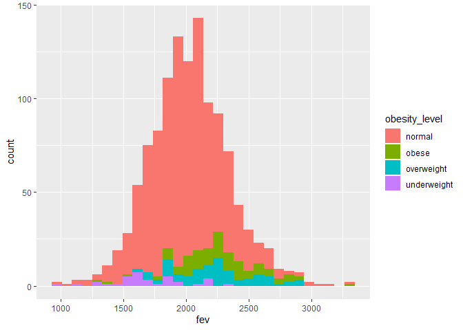

Assignment 2
================
Carmen Chen
10/4/2021

\#\#Step 1: Data Wrangling

\#Download the datasets

``` r
#individual dataset
ind <- "chs_individual.csv"
if (!file.exists(ind))
  download.file("https://raw.githubusercontent.com/USCbiostats/data-science-data/master/01_chs/chs_individual.csv", destfile = ind)

ind <- read.csv(ind)
ind <- as.tibble(ind)
```

    ## Warning: `as.tibble()` was deprecated in tibble 2.0.0.
    ## Please use `as_tibble()` instead.
    ## The signature and semantics have changed, see `?as_tibble`.

``` r
#regional dataset
reg <- "chs_regional.csv"
if (!file.exists(reg))
  download.file("https://raw.githubusercontent.com/USCbiostats/data-science-data/master/01_chs/chs_regional.csv", destfile = reg)

reg <- read.csv(reg)
reg <- as.tibble(reg)
```

\#Merge the data

``` r
data <- merge(
  x = ind,
  y = reg,
  all.x = TRUE,
  all.y = TRUE,
  by.x = "townname",
  by.y = "townname"
)
```

\#Check the dataset

``` r
data %>% nrow()
```

    ## [1] 1200

``` r
colSums(is.na(data))
```

    ##      townname           sid          male          race      hispanic 
    ##             0             0             0             0             0 
    ##        agepft        height        weight           bmi        asthma 
    ##            89            89            89            89            31 
    ## active_asthma father_asthma mother_asthma        wheeze      hayfever 
    ##             0           106            56            71           118 
    ##       allergy   educ_parent         smoke          pets      gasstove 
    ##            63            64            40             0            33 
    ##           fev           fvc          mmef     pm25_mass      pm25_so4 
    ##            95            97           106             0             0 
    ##      pm25_no3      pm25_nh4       pm25_oc       pm25_ec       pm25_om 
    ##             0             0             0             0             0 
    ##       pm10_oc       pm10_ec       pm10_tc        formic        acetic 
    ##             0             0             0             0             0 
    ##           hcl          hno3        o3_max         o3106         o3_24 
    ##             0             0             0             0             0 
    ##           no2          pm10       no_24hr      pm2_5_fr         iacid 
    ##             0             0           100           300             0 
    ##         oacid   total_acids           lon           lat 
    ##             0             0             0             0

``` r
data <- data %>% 
     group_by(male, hispanic) %>%
     mutate(height = replace(height, is.na(height), mean(height, na.rm = TRUE)))

data <- data %>% 
     group_by(male, hispanic) %>%
     mutate(agepft = replace(agepft, is.na(agepft), mean(agepft, na.rm = TRUE)))

data <- data %>% 
     group_by(male, hispanic) %>%
     mutate(weight = replace(weight, is.na(weight), mean(weight, na.rm = TRUE)))

data <- data %>% 
     group_by(male, hispanic) %>%
     mutate(bmi = replace(bmi, is.na(bmi), mean(bmi, na.rm = TRUE)))

data <- data %>% 
     group_by(male, hispanic) %>%
     mutate(asthma  = replace(asthma, is.na(asthma), median(asthma, na.rm = TRUE)))

data <- data %>% 
     group_by(male, hispanic) %>%
     mutate(father_asthma = replace(father_asthma, is.na(father_asthma), median(father_asthma, na.rm = TRUE)))

data <- data %>% 
     group_by(male, hispanic) %>%
     mutate(mother_asthma = replace(mother_asthma, is.na(mother_asthma), median(mother_asthma, na.rm = TRUE)))

data <- data %>% 
     group_by(male, hispanic) %>%
     mutate(wheeze = replace(wheeze, is.na(wheeze), median(wheeze, na.rm = TRUE)))

data <- data %>% 
     group_by(male, hispanic) %>%
     mutate(hayfever = replace(hayfever, is.na(hayfever), median(hayfever, na.rm = TRUE)))

data <- data %>% 
     group_by(male, hispanic) %>%
     mutate(allergy = replace(allergy, is.na(allergy), median(allergy, na.rm = TRUE)))

data <- data %>% 
     group_by(male, hispanic) %>%
     mutate(educ_parent = replace(educ_parent, is.na(educ_parent), median(educ_parent, na.rm = TRUE)))

data <- data %>% 
     group_by(male, hispanic) %>%
     mutate(smoke = replace(smoke, is.na(smoke), median(smoke, na.rm = TRUE)))

data <- data %>% 
     group_by(male, hispanic) %>%
     mutate(gasstove = replace(gasstove, is.na(gasstove), median(gasstove, na.rm = TRUE)))

data <- data %>% 
     group_by(male, hispanic) %>%
     mutate(fev = replace(fev, is.na(fev), mean(fev, na.rm = TRUE)))

data <- data %>% 
     group_by(male, hispanic) %>%
     mutate(fvc = replace(fvc, is.na(fvc), mean(fvc, na.rm = TRUE)))

data <- data %>% 
     group_by(male, hispanic) %>%
     mutate(mmef = replace(mmef, is.na(mmef), mean(mmef, na.rm = TRUE)))

data <- data %>% 
     group_by(male, hispanic) %>%
     mutate(no_24hr = replace(no_24hr, is.na(no_24hr), mean(no_24hr, na.rm = TRUE)))

data <- data %>% 
     group_by(male, hispanic) %>%
     mutate(pm2_5_fr = replace(pm2_5_fr, is.na(pm2_5_fr), mean(pm2_5_fr, na.rm = TRUE)))

colSums(is.na(data))
```

    ##      townname           sid          male          race      hispanic 
    ##             0             0             0             0             0 
    ##        agepft        height        weight           bmi        asthma 
    ##             0             0             0             0             0 
    ## active_asthma father_asthma mother_asthma        wheeze      hayfever 
    ##             0             0             0             0             0 
    ##       allergy   educ_parent         smoke          pets      gasstove 
    ##             0             0             0             0             0 
    ##           fev           fvc          mmef     pm25_mass      pm25_so4 
    ##             0             0             0             0             0 
    ##      pm25_no3      pm25_nh4       pm25_oc       pm25_ec       pm25_om 
    ##             0             0             0             0             0 
    ##       pm10_oc       pm10_ec       pm10_tc        formic        acetic 
    ##             0             0             0             0             0 
    ##           hcl          hno3        o3_max         o3106         o3_24 
    ##             0             0             0             0             0 
    ##           no2          pm10       no_24hr      pm2_5_fr         iacid 
    ##             0             0             0             0             0 
    ##         oacid   total_acids           lon           lat 
    ##             0             0             0             0

\#Creat categorical varialbes

``` r
data$obesity_level <- as.factor(ifelse(data$bmi<14, "underweight",
                        ifelse(data$bmi<=22, "normal",
                               ifelse(data$bmi<=24, "overweight", "obese"))))

tapply(data$bmi, data$obesity_level, summary)
```

    ## $normal
    ##    Min. 1st Qu.  Median    Mean 3rd Qu.    Max. 
    ##   14.00   15.78   17.22   17.40   18.63   21.96 
    ## 
    ## $obese
    ##    Min. 1st Qu.  Median    Mean 3rd Qu.    Max. 
    ##   24.01   25.07   26.07   26.97   27.77   41.27 
    ## 
    ## $overweight
    ##    Min. 1st Qu.  Median    Mean 3rd Qu.    Max. 
    ##   22.02   22.45   22.82   22.94   23.55   24.00 
    ## 
    ## $underweight
    ##    Min. 1st Qu.  Median    Mean 3rd Qu.    Max. 
    ##   11.30   13.00   13.45   13.32   13.75   13.99

``` r
data$smoke_gas_exposure <- as.factor(
  ifelse(data$smoke==1 & data$gasstove==1, "Both",           
  ifelse(data$smoke==1 & data$gasstove==0, "Only second hand smoke",
  ifelse(data$smoke==0 & data$gasstove==0, "Neither", "Only gas stove"))))

table(data$smoke_gas_exposure, data$smoke)
```

    ##                         
    ##                            0   1
    ##   Both                     0 154
    ##   Neither                219   0
    ##   Only gas stove         791   0
    ##   Only second hand smoke   0  36

``` r
table(data$smoke_gas_exposure, data$gasstove)
```

    ##                         
    ##                            0   1
    ##   Both                     0 154
    ##   Neither                219   0
    ##   Only gas stove           0 791
    ##   Only second hand smoke  36   0

\#Create summary tables

``` r
library(data.table)
```

    ## 
    ## Attaching package: 'data.table'

    ## The following objects are masked from 'package:dplyr':
    ## 
    ##     between, first, last

    ## The following object is masked from 'package:purrr':
    ## 
    ##     transpose

``` r
#by townname
data %>%
  group_by(townname,asthma) %>%
  summarise(mean_fev = mean(fev, na.rm = TRUE),
            sd_fev = sd(fev, na.rm =TRUE),
            n = n(),
            sd_asthma = sd(asthma, na.rm = TRUE)) %>%
  mutate(prop = prop.table(n)) %>%
  knitr::kable()
```

    ## `summarise()` has grouped output by 'townname'. You can override using the `.groups` argument.

| townname      | asthma | mean\_fev |  sd\_fev |   n | sd\_asthma | prop |
|:--------------|-------:|----------:|---------:|----:|-----------:|-----:|
| Alpine        |      0 |  2087.343 | 290.5699 |  89 |          0 | 0.89 |
| Alpine        |      1 |  2085.141 | 310.4269 |  11 |          0 | 0.11 |
| Atascadero    |      0 |  2052.690 | 307.4435 |  75 |          0 | 0.75 |
| Atascadero    |      1 |  2145.520 | 367.5628 |  25 |          0 | 0.25 |
| Lake Elsinore |      0 |  2041.507 | 302.2584 |  88 |          0 | 0.88 |
| Lake Elsinore |      1 |  2019.359 | 327.1585 |  12 |          0 | 0.12 |
| Lake Gregory  |      0 |  2076.169 | 333.0693 |  85 |          0 | 0.85 |
| Lake Gregory  |      1 |  2133.040 | 235.3165 |  15 |          0 | 0.15 |
| Lancaster     |      0 |  1994.316 | 311.5493 |  84 |          0 | 0.84 |
| Lancaster     |      1 |  2048.871 | 352.1679 |  16 |          0 | 0.16 |
| Lompoc        |      0 |  2019.553 | 336.4375 |  89 |          0 | 0.89 |
| Lompoc        |      1 |  2154.108 | 454.1000 |  11 |          0 | 0.11 |
| Long Beach    |      0 |  2009.417 | 314.1682 |  87 |          0 | 0.87 |
| Long Beach    |      1 |  1828.217 | 321.9581 |  13 |          0 | 0.13 |
| Mira Loma     |      0 |  1979.642 | 334.2006 |  85 |          0 | 0.85 |
| Mira Loma     |      1 |  2016.711 | 274.5174 |  15 |          0 | 0.15 |
| Riverside     |      0 |  1989.006 | 275.9060 |  89 |          0 | 0.89 |
| Riverside     |      1 |  1996.959 | 304.0447 |  11 |          0 | 0.11 |
| San Dimas     |      0 |  2031.537 | 318.2881 |  83 |          0 | 0.83 |
| San Dimas     |      1 |  2003.637 | 330.0140 |  17 |          0 | 0.17 |
| Santa Maria   |      0 |  2025.779 | 302.2363 |  87 |          0 | 0.87 |
| Santa Maria   |      1 |  2025.558 | 386.4252 |  13 |          0 | 0.13 |
| Upland        |      0 |  2044.133 | 350.3748 |  88 |          0 | 0.88 |
| Upland        |      1 |  1878.575 | 250.1978 |  12 |          0 | 0.12 |

``` r
#by sex
data %>%
  group_by(male,asthma) %>%
  summarise(mean_fev = mean(fev, na.rm = TRUE),
            sd_fev = sd(fev, na.rm =TRUE),
            n = n(),
            sd_asthma = sd(asthma, na.rm = TRUE)) %>%
  mutate(prop = prop.table(n)) %>%
  knitr::kable()
```

    ## `summarise()` has grouped output by 'male'. You can override using the `.groups` argument.

| male | asthma | mean\_fev |  sd\_fev |   n | sd\_asthma |      prop |
|-----:|-------:|----------:|---------:|----:|-----------:|----------:|
|    0 |      0 |  1953.544 | 306.4548 | 538 |          0 | 0.8819672 |
|    0 |      1 |  1999.015 | 349.8081 |  72 |          0 | 0.1180328 |
|    1 |      0 |  2111.941 | 304.0853 | 491 |          0 | 0.8322034 |
|    1 |      1 |  2063.348 | 322.5267 |  99 |          0 | 0.1677966 |

``` r
#by obesity level
data %>%
  group_by(obesity_level,asthma) %>%
  summarise(mean_fev = mean(fev, na.rm = TRUE),
            sd_fev = sd(fev, na.rm =TRUE),
            n = n(),
            sd_asthma = sd(asthma, na.rm = TRUE)) %>%
  mutate(prop = prop.table(n)) %>%
  knitr::kable()
```

    ## `summarise()` has grouped output by 'obesity_level'. You can override using the `.groups` argument.

| obesity\_level | asthma | mean\_fev |  sd\_fev |   n | sd\_asthma |      prop |
|:---------------|-------:|----------:|---------:|----:|-----------:|----------:|
| normal         |      0 |  2003.242 | 291.6703 | 842 |          0 | 0.8635897 |
| normal         |      1 |  1977.962 | 316.9062 | 133 |          0 | 0.1364103 |
| obese          |      0 |  2255.617 | 336.0641 |  82 |          0 | 0.7961165 |
| obese          |      1 |  2307.300 | 283.9257 |  21 |          0 | 0.2038835 |
| overweight     |      0 |  2226.277 | 313.9086 |  73 |          0 | 0.8390805 |
| overweight     |      1 |  2214.127 | 347.3845 |  14 |          0 | 0.1609195 |
| underweight    |      0 |  1680.030 | 305.1428 |  32 |          0 | 0.9142857 |
| underweight    |      1 |  1893.504 | 243.1512 |   3 |          0 | 0.0857143 |

``` r
#by smoke_gas_exposure
data %>%
  group_by(smoke_gas_exposure,asthma) %>%
  summarise(mean_fev = mean(fev, na.rm = TRUE),
            sd_fev = sd(fev, na.rm =TRUE),
            n = n(),
            sd_asthma = sd(asthma, na.rm = TRUE)) %>%
  mutate(prop = prop.table(n)) %>%
  knitr::kable()
```

    ## `summarise()` has grouped output by 'smoke_gas_exposure'. You can override using the `.groups` argument.

| smoke\_gas\_exposure   | asthma | mean\_fev |  sd\_fev |   n | sd\_asthma |      prop |
|:-----------------------|-------:|----------:|---------:|----:|-----------:|----------:|
| Both                   |      0 |  2024.646 | 302.1828 | 135 |          0 | 0.8766234 |
| Both                   |      1 |  2025.715 | 297.3824 |  19 |          0 | 0.1233766 |
| Neither                |      0 |  2065.470 | 325.1364 | 188 |          0 | 0.8584475 |
| Neither                |      1 |  2003.467 | 350.9435 |  31 |          0 | 0.1415525 |
| Only gas stove         |      0 |  2017.523 | 316.1165 | 676 |          0 | 0.8546144 |
| Only gas stove         |      1 |  2052.931 | 337.5528 | 115 |          0 | 0.1453856 |
| Only second hand smoke |      0 |  2082.940 | 281.3884 |  30 |          0 | 0.8333333 |
| Only second hand smoke |      1 |  1919.583 | 354.8603 |   6 |          0 | 0.1666667 |

\#\#Step 2: Looking at the Data (EDA)

1.  Facet plot showing scatterplots with regression lines of BMI vs FEV
    by “townname”.

``` r
library(ggplot2)
ggplot(data) + 
  geom_point(mapping = aes(x = bmi, y = fev, color = townname)) + 
  geom_smooth(mapping = aes(x = bmi, y = fev, linetype = townname)) + 
  facet_wrap(~townname)
```

    ## `geom_smooth()` using method = 'loess' and formula 'y ~ x'

<!-- -->

2.  Stacked histograms of FEV by BMI category and FEV by smoke/gas
    exposure. Use different color schemes than the ggplot default.

``` r
#by obesity level
ggplot(data, aes(x = fev)) +
  geom_histogram(aes(fill = obesity_level))
```

    ## `stat_bin()` using `bins = 30`. Pick better value with `binwidth`.

<!-- -->

``` r
#by smoke/gas exposure
ggplot(data, aes(x = fev)) +
  geom_histogram(aes(fill = smoke_gas_exposure))
```

    ## `stat_bin()` using `bins = 30`. Pick better value with `binwidth`.

<!-- -->

3.  Barchart of BMI by smoke/gas exposure.

``` r
ggplot(data) +
  geom_bar(mapping = aes(x = obesity_level, fill = smoke_gas_exposure))
```

<!-- -->

4.  Statistical summary graphs of FEV by BMI and FEV by smoke/gas
    exposure category.

``` r
#boxplot of FEV by obesity level
ggplot(data) +
  geom_boxplot(mapping = aes(x = obesity_level, y = fev))
```

<!-- -->

``` r
#boxplot of FEV by smoke/gas exposure category
ggplot(data) +
  geom_boxplot(mapping = aes(x = smoke_gas_exposure, y = fev))
```

<!-- -->

5.  A leaflet map showing the concentrations of PM2.5 mass in each of
    the CHS communities.

``` r
library(leaflet)

pm25.pal <- colorNumeric(c('darkgreen', 'goldenrod', 'brown'), domain=data$pm25_mass)

leaflet(data) %>%
  addProviderTiles('CartoDB.Positron') %>%
  addCircles(
    lat = ~lat, lng = ~lon,
    label = ~paste0(round(pm25_mass, 2), '  PM2.5 mass'), color = ~ pm25.pal(pm25_mass),
    opacity = 1, fillOpacity = 1, radius = 500
    ) %>%
  addLegend('bottomleft', pal=pm25.pal, values=data$pm25_mass,
          title='PM2.5 mass', opacity=1)
```

6.  Choose a visualization to examine whether PM2.5 mass is associated
    with FEV.

``` r
#general
ggplot(data, mapping = aes(x = pm25_mass, y = fev)) + 
  geom_point() + 
  geom_smooth()
```

    ## `geom_smooth()` using method = 'gam' and formula 'y ~ s(x, bs = "cs")'

<!-- -->

``` r
#by sex
data$sex <- ifelse(data$male == 0, "female", "male")
ggplot(data, mapping = aes(x = pm25_mass, y = fev, color = sex, linetype = sex)) + 
  geom_point() + 
  geom_smooth()
```

    ## `geom_smooth()` using method = 'loess' and formula 'y ~ x'

<!-- -->
